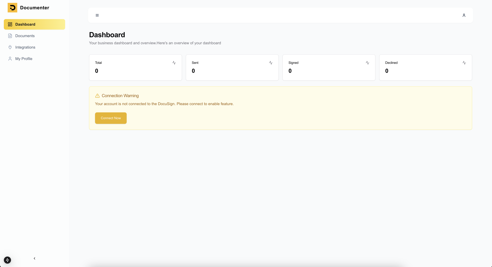
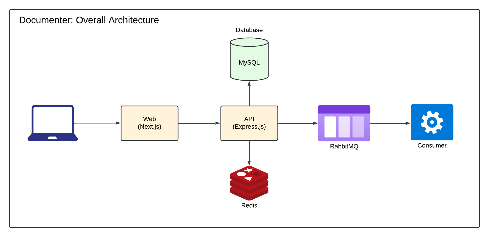

# Documenter

This application provides a robust solution for managing documents with seamless integration with DocuSign for electronic signature workflows. It simplifies document handling processes, from creation to signing, ensuring a secure and efficient workflow for users.



## **Features**:

- **User Authentication**: Secure user registration, login, and profile management.
- **Document Management**: Create, view, update, delete, and send documents effortlessly.
- **Analytics**: Gain insights into document usage and status with analytics.
- **DocuSign Integration**:
   - Authenticate with DocuSign to enable signature workflows.
   - ~~Real-time webhook updates for signature events.~~
- **Secure Access**: All sensitive actions are protected using authentication middleware.

## **Architecture**:


## **Technology Stack**:

- **Node.js/TypeScript**: Scalable, type-safe backend for asynchronous operations.
- **React.js/Next.js**: High-performance, SEO-friendly frontend with SSR/SSG.
- **Redux/RTK**: Predictable and scalable state management.
- **PostgreSQL**: Reliable relational database with advanced querying.
- **Redis**: In-memory store for caching and real-time data.
- **RabbitMQ**: Message broker for asynchronous workflows and service decoupling.

---

## **Setup Steps**

1. **Clone the Repository**:

   ```bash
   git clone https://github.com/toshahriar/documenter.git
   cd documenter
   ```

2. **Prepare Environment Files**:

   ```bash
   make prepare
   ```

   This will copy example `.env` files for the `root` and `api`. You need to update all the environment variables in `api/.env`


3. **Install Dependencies**:

   ```bash
   make install
   ```

4. **Start the Project**:

   ```bash
   make start
   ```

5. **Run Migration & Seeder**:

   ```bash
   make migration
   make seed
   ```

6. **Application URLs**:
    - **Web**: [http://localhost:3000](http://localhost:3000)
    - **API**: [http://localhost:3001](http://localhost:3001)
   
---

## **Default Login Credentials**

Use these credentials to log in after setup:

- Email: `admin@documenter.io`
- Pass: `p@ssword`

---

## **Available Commands**

| Command              | Description                         |
|----------------------|-------------------------------------|
| `make prepare`       | Sets up environment files           |
| `make install`       | Installs project dependencies       |
| `make start`         | Starts the Docker containers        |
| `make stop`          | Stops the Docker containers         |
| `make reset`         | Stops containers and clears volumes |
| `make api-logs`      | Shows logs for the API service      |
| `make web-logs`      | Shows logs for the web service      |
| `make consumer-logs` | Shows logs for the consumer service |
| `make migration`     | Run the migrations of API service   |
| `make seed`          | Insert fake data for development    |

By using the script.sh, you can also run all the commands supported by make!
```bash
./script.sh prepare
./script.sh install
./script.sh start
./script.sh stop
./script.sh reset
./script.sh api-logs
./script.sh web-logs
./script.sh consumer-logs
./script.sh migration
./script.sh seed
```
---

## **API Endpoints**

### **Auth**
| Method | Endpoint                              | Description                |
|--------|---------------------------------------|----------------------------|
| POST   | `/api/v1/auth/register`               | Register a new user        |
| GET    | `/api/v1/auth/account-verify`         | Verify user account        |
| POST   | `/api/v1/auth/token`                  | Generate auth token        |
| POST   | `/api/v1/auth/refresh-token`          | Refresh auth token         |
| POST   | `/api/v1/auth/forgot-password`        | Request password reset     |
| POST   | `/api/v1/auth/reset-password`         | Reset password             |
| POST   | `/api/v1/auth/me`                     | Get logged-in user profile |
| POST   | `/api/v1/auth/logout`                 | Logout user                |

### **Docusign**
| Method | Endpoint                              | Description                |
|--------|---------------------------------------|----------------------------|
| GET    | `/api/v1/docusign/auth`               | Authenticate with Docusign |
| GET    | `/api/v1/docusign/auth/callback`      | Handle Docusign callback   |
| POST   | `/api/v1/docusign/webhook`            | Handle Docusign webhook    |

### **Document**
| Method | Endpoint                              | Description                |
|--------|---------------------------------------|----------------------------|
| GET    | `/api/v1/document/analytic`           | Get document analytics     |
| GET    | `/api/v1/document`                    | List all documents         |
| POST   | `/api/v1/document`                    | Create a new document      |
| GET    | `/api/v1/document/:id`                | Get details of a document  |
| PUT    | `/api/v1/document/:id`                | Update a document          |
| DELETE | `/api/v1/document/:id`                | Delete a document          |
| GET    | `/api/v1/document/:id/send`           | Send a document            |

### **Profile**
| Method | Endpoint                              | Description                |
|--------|---------------------------------------|----------------------------|
| POST   | `/api/v1/profile`                     | Update user profile        |
